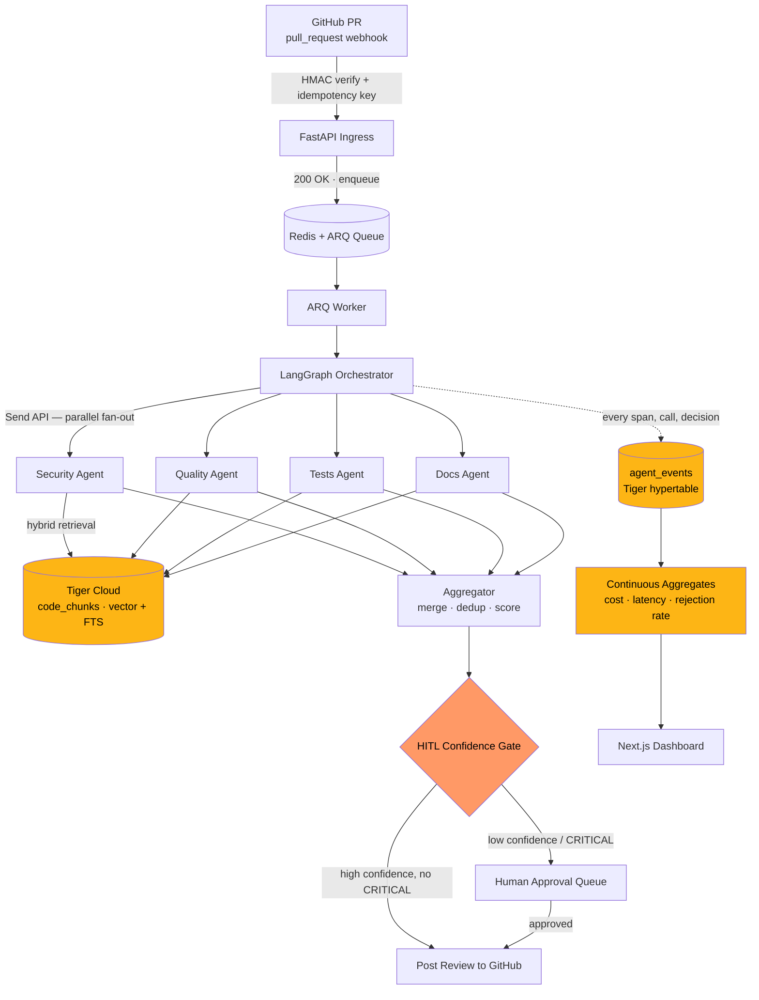
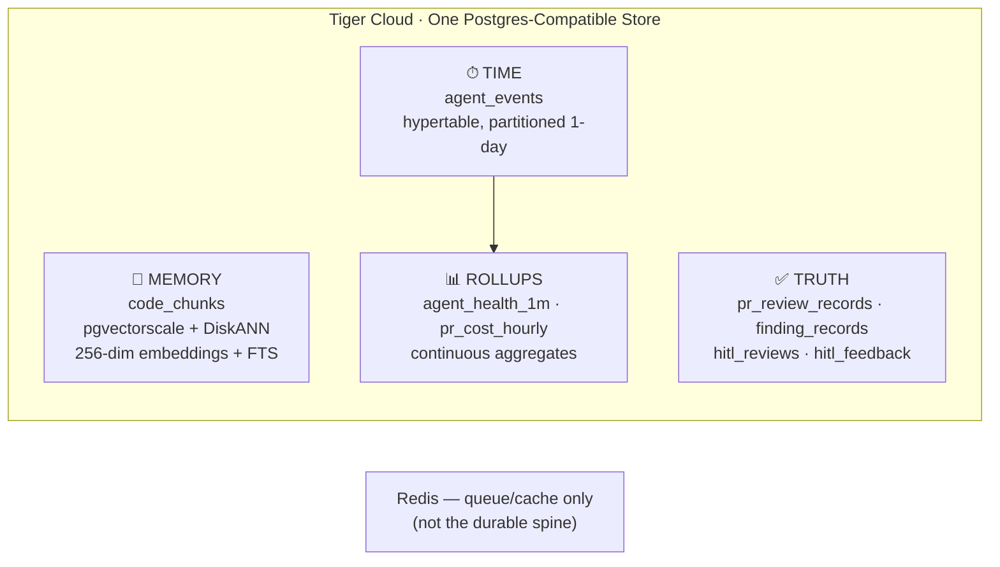

# 🤖 AI Pull-Request Review Agent

> A production-grade, multi-agent code review system that reasons like a senior engineer — grounded in retrieved codebase context, fanned out across specialist reviewers, and provable end-to-end.

[](https://www.python.org/)
[](https://fastapi.tiangolo.com/)
[](https://www.langchain.com/langgraph)
[](https://nextjs.org/)
[](https://www.tigerdata.com/)
[](https://redis.io/)
[](#license)
[](#project-status)

---

## 📖 Table of Contents

1. [Why This Exists](#-why-this-exists)
2. [System Architecture](#-system-architecture)
3. [Data Architecture — One Spine, Three Lanes](#-data-architecture--one-spine-three-lanes)
4. [Tech Stack](#-tech-stack)
5. [The Four Specialist Agents](#-the-four-specialist-agents)
6. [Human-in-the-Loop Gate](#-human-in-the-loop-gate)
7. [Repository / Module Map](#-repository--module-map)
8. [20-Day Build Plan (3 Developers)](#-20-day-build-plan-3-developers)
9. [Team & Ownership](#-team--ownership)
10. [Getting Started](#-getting-started)
11. [Environment Variables](#-environment-variables)
12. [Architecture Decision Records](#-architecture-decision-records)
13. [Roadmap Beyond Day 20](#-roadmap-beyond-day-20)
14. [Acknowledgements](#-acknowledgements)
15. [License](#-license)

---

## 🎯 Why This Exists

Every pull request in a human-only workflow waits on a senior engineer's attention — the scarcest resource on a team. That attention is **slow** (PRs queue for hours), **inconsistent** (the same bug is caught Monday and missed Friday), and **fatigued** (the tenth review of the day isn't the first).

This agent exists to solve exactly one problem: **reclaim senior-reviewer attention by automating the mechanical part of review**, so humans are spent only where judgment is genuinely scarce.

It is **not** a linter with an LLM bolted on. It is a fan-out of specialist reasoners over a diff, grounded in retrieved codebase context, with every action written to one time-ordered spine.

**Design posture:** selective, not exhaustive. The system surfaces high-value findings and defers uncertain ones to a human — it does not flood the PR with noise.

---

## 🏗 System Architecture



**Flow in one sentence:** GitHub → FastAPI ingress → Redis/ARQ → LangGraph (four parallel specialist agents, each grounded by retrieval) → Aggregator → confidence-weighted HITL gate → GitHub, with every action recorded to one Tiger Cloud spine and surfaced on a Next.js dashboard.

### Why an orchestration graph, not a single prompt

| Rung | What it does | Why it falls short |
|---|---|---|
| Linters | Pattern-match syntax/style | No semantics, no intent |
| Static analysis | Data-flow & type checks | High false positives, no repo-wide judgment |
| Single-LLM review | One prompt judges the whole diff | Collapses 4 concerns into 1, hallucinates with confidence, no audit |
| **Agentic fan-out (this project)** | 4 grounded, skeptical specialists merged by an aggregator | Demands orchestration, retrieval, and a proof layer — paid for below |

---

## 🗄 Data Architecture — One Spine, Three Lanes

Rather than splitting memory (Qdrant), truth (Postgres), and time (a time-series DB) across three services, this project consolidates onto **one Tiger Cloud (managed Postgres + TimescaleDB + pgvector/pgvectorscale) instance** — one backup story, one connection pool, one place to query a PR's full story.



| Data shape | Store | What it holds |
|---|---|---|
| Memory | `code_chunks` (pgvector + pgvectorscale + DiskANN, plus GIN full-text index) | Embedded code chunks for hybrid semantic + keyword retrieval |
| Truth | Standard relational tables | Reviews, findings, GitHub review IDs, HITL decisions |
| Time | `agent_events` hypertable | Every span, LLM call, tool call, cost, latency, decision |
| Rollups | Continuous aggregates | Precomputed cost/latency/rejection-rate for the dashboard & `BudgetGuard` |

> **Redis stays** for the job queue and LangGraph checkpointing — it's short-lived, high-churn data that doesn't belong in the durable spine. "One database" means one durable data spine, not forcing every workload into SQL.

---

## 🧰 Tech Stack

| Layer | Technology | Purpose |
|---|---|---|
| Ingress / API | FastAPI | Webhook receiver, HMAC verification, REST API |
| Queue | Redis + ARQ | Async job queue, decouples ingress from processing |
| Orchestration | LangGraph | Parallel agent fan-out (`Send` API), checkpointed state graph |
| Reasoning | OpenAI (or routed LLMs) | Specialist agent reasoning, structured output |
| Data spine | Tiger Cloud (TimescaleDB + pgvector + pgvectorscale) | Memory, truth, and time in one Postgres-compatible store |
| Retrieval | Hybrid: DiskANN vector search + Postgres FTS | Grounding every specialist in real codebase context |
| Frontend | Next.js | Review dashboard, HITL queue, trace viewer, cost view |
| Observability | OpenTelemetry → `agent_events` | Traces, audit trail, cost ledger from one table |
| Deployment | Railway (or equivalent) | Hosting for API, worker, and dashboard |
| VCS integration | GitHub App (Webhooks + REST) | Trigger and posting target |

---

## 🕵️ The Four Specialist Agents

Modeled directly on how a senior engineer actually reviews — four distinct mindsets, not one blended pass:

| Agent | Question it asks | Looks for |
|---|---|---|
| 🔐 **Security** | "Could this be exploited?" | Injection risks, secrets in code, auth bypasses, unsafe deserialization |
| ⚙️ **Quality** | "Is the logic right?" | Correctness bugs, logic errors, code smells, unnecessary complexity |
| 🧪 **Tests** | "What's untested?" | Missing cases, untested edge conditions, brittle assertions, coverage gaps |
| 📚 **Docs** | "Will the next reader understand?" | Missing docstrings, outdated comments, undocumented public APIs |

Every specialist returns a structured `Finding`:

```
agent_type · severity · category · file/line · confidence · rationale
```

Structured output — not prose — is what lets the aggregator merge deterministically instead of stitching text.

---

## 🚦 Human-in-the-Loop Gate

| Condition | Action | Why |
|---|---|---|
| High confidence, no `CRITICAL` finding | Post automatically | System has earned autonomy |
| Confidence below threshold | Route to human approval queue | Defer judgment under uncertainty |
| Any `CRITICAL` finding | Escalate regardless of confidence | Consequence of a missed critical issue is too high |
| Developer disputes a posted finding | Route to dispute + record feedback | Feeds the continuous-learning loop |

---

## 🧩 Repository / Module Map

A modular monolith — one process, inward-only dependencies. Any outer module can be deleted and the inner ones still compile.

```
├── agents/            # 4 specialists + base_agent + Finding contract
├── api/                # REST endpoints (reviews, economics, HITL, queue)
├── auth/               # RBAC dependencies
├── core/               # Abstract workflow_engine interface, shared exceptions
├── data/               # Code-chunk ingestion + freshness tracking
├── database/           # Async engine, Tiger pool, ORM models, repositories
├── economics/          # Cost repository, BudgetGuard, model-routing advisor
├── evaluation/         # Golden dataset, LLM-as-judge, regression gate
├── hitl/                # Approval queue, escalation, feedback, dispute API
├── integrations/       # GitHub REST client + payload models
├── job_queue/          # ARQ worker process
├── memory/              # TigerMemoryClient, embedder, hybrid retriever, Redis cache
├── models/              # Pydantic schemas (Finding, Review, WebhookEvent)
├── observability/       # Event emission, tracing, audit, alerting
├── orchestrator/        # LangGraph graph, nodes, typed state, engine impl
├── prompts/              # Versioned prompt registry per agent
├── reliability/          # Retry, circuit breaker, idempotency, timeout
├── security/             # Threat model, prompt-injection guard, RBAC, masking
├── tools/                # Tool registry, model router, LLM client, Docker sandbox
├── webhook_receiver/     # HMAC validation, payload parsing, event routing
├── migrations/           # Idempotent Tiger Cloud schema DDL
└── frontend/             # Next.js dashboard (review, HITL queue, trace viewer)
```

---

## 📅 20-Day Build Plan (3 Developers)

The build follows a 20-phase production lifecycle exactly — each phase proves one thing and ends green before the next starts.

**Team:** `Dev A` — Backend, Orchestration & Infra · `Dev B` — AI/ML, Retrieval & Evaluation · `Dev C` — Frontend, Observability & Governance

| Day | Phase | Focus | Owner(s) | Green Gate |
|:---:|---|---|:---:|---|
| 1 | 0 — Cognitive Design | Autonomy level, HITL boundaries, 5-move design template applied | All 3 | Design doc + ADR-000 written |
| 2 | 1 — System Architecture | Module graph, ADR-001/002 drafted, dependency rule defined | All 3 | Architecture reviewed & approved |
| 3 | 2 — Frontend Shell | Next.js scaffold, dashboard shell, streaming groundwork | Dev C | Dashboard shell renders |
| 4 | 3 — Backend & API | FastAPI up, webhook route, HMAC validation, idempotency key check | Dev A | Signed webhook accepted; replay rejected |
| 5 | 4 — Workflow Orchestration | LangGraph `StateGraph`, `Send` fan-out, Redis checkpointing | Dev A | 4 nodes fan out in parallel; crash resumes from checkpoint |
| 6 | 5 — LLM & Reasoning | Model routing per agent, structured output, prompt registry | Dev B | Each agent returns a valid `Finding` |
| 7 | 6 — Memory Architecture | pgvectorscale + DiskANN setup, hybrid retrieval (vector + FTS) | Dev B | Top-k retrieval returns relevant chunks |
| 8 | 7 — Tooling & Sandboxing | Tool registry, permission scoping, Docker sandbox isolation | Dev A | Tool calls scoped; sandbox isolates execution |
| 9 | 8 — Multi-Agent Systems | Security/Quality/Tests/Docs agents + aggregator merge & dedup | Dev B | One merged review from 4 agents |
| 10 | 9 — Evaluation | Golden PR dataset, LLM-as-judge, regression gate | Dev B | Regression gate blocks a bad prompt change |
| 11 | 10 — Observability | `emit_agent_event` wired into every node → `agent_events` hypertable | Dev C | Full trace reconstructable per `review_id` |
| 12 | 11 — Security | Threat model, prompt-injection guard, RBAC, secret masking | Dev A | Threat model written; injection guard tested |
| 13 | 12 — Reliability | Retries, circuit breakers, timeouts, dedup — fault injection tested | Dev A | System degrades to slower-but-correct under induced failure |
| 14 | 13 — Infrastructure | Tiger Cloud provisioned, extensions verified, deployment config | Dev A | `timescaledb`, `vector`, `vectorscale` confirmed live |
| 15 | 14 — Data Engineering | Ingestion pipeline, `repo_file_index` freshness tracking, migrations | Dev B | Incremental re-embed only touches changed files |
| 16 | 15 — Governance | Audit logs queryable, explainability per finding | Dev C | Any finding traceable to its context + prompt version |
| 17 | 16 — Economics | Continuous aggregates wired, `BudgetGuard` hard-block on cap | Dev C | Per-agent cost visible; spend cap enforced |
| 18 | 17 — Developer Experience | Prompt playground, trace viewer UI | Dev C | Trace viewer usable end-to-end |
| 19 | 18 & 19 — CI/CD + HITL | Prompt versioning, eval gates, canary path; approval queue & dispute flow | Dev A + Dev C | PR pipeline gated on eval regression; HITL queue functional |
| 20 | 20 — Continuous Learning + Demo | Drift detection on rejection rate, final polish, demo walkthrough | All 3 | End-to-end demo on a real PR; README + video finalized |

---

## 👥 Team & Ownership

| Developer | Primary Modules | Responsibilities |
|---|---|---|
| **Dev A** — Backend/Infra Lead | `webhook_receiver/`, `orchestrator/`, `reliability/`, `security/`, `tools/`, `database/`, infra | Ingress, orchestration engine, reliability mechanics, Tiger Cloud provisioning |
| **Dev B** — AI/ML Lead | `agents/`, `memory/`, `prompts/`, `evaluation/`, `data/` | Specialist agents, retrieval pipeline, evaluation harness, ingestion |
| **Dev C** — Frontend/Observability Lead | `frontend/`, `observability/`, `economics/`, `hitl/`, `api/` | Dashboard, tracing/audit, cost control, human-review workflows |

All three pair on Day 1, Day 2, and Day 20 (design, architecture sign-off, and integration/demo).

---

## 🚀 Getting Started

### Prerequisites
- Python 3.11+
- Node.js 18+
- Redis
- A [Tiger Cloud](https://console.cloud.timescale.com/) account (free trial available)
- An OpenAI API key
- A registered GitHub App (webhook + private key)

### 1. Clone & install
```bash
git clone https://github.com/<your-org>/ai-pr-review-agent.git
cd ai-pr-review-agent

# Backend
python -m venv .venv && source .venv/bin/activate
pip install -r requirements.txt

# Frontend
cd frontend && npm install && cd ..
```

### 2. Configure environment
Copy `.env.example` to `backend/.env` and fill in the values below.

### 3. Provision the database
```bash
psql "$TIGER_DATABASE_URL" -f scripts/migrations/2026-06-tiger-init.sql
```

### 4. Run the stack
```bash
# Terminal 1 — API
uvicorn backend.main:app --reload

# Terminal 2 — Worker
arq backend.job_queue.arq_worker.WorkerSettings

# Terminal 3 — Frontend
cd frontend && npm run dev
```

### 5. Point a GitHub repo at it
Configure your GitHub App's webhook URL to your ingress endpoint and install it on a test repository. Open a PR and watch the review appear.

---

## 🔑 Environment Variables

| Variable | Source | Used By |
|---|---|---|
| `TIGER_DATABASE_URL` | Tiger Cloud connection string | DB connection, `TigerMemoryClient` |
| `OPENAI_API_KEY` | OpenAI dashboard | Embeddings + LLM calls |
| `GITHUB_APP_ID` | GitHub developer settings | Webhook + PR posting |
| `GITHUB_WEBHOOK_SECRET` | GitHub App settings | HMAC signature verification |
| `GITHUB_PRIVATE_KEY_PATH` | GitHub App settings | Authenticated GitHub API calls |
| `REDIS_URL` | Local/hosted Redis instance | Queue + LangGraph checkpointing |

> Never commit `.env` or secrets to source control — keep them in `backend/.env`, which is git-ignored.

---

## 📐 Architecture Decision Records

| ADR | Decision |
|---|---|
| **ADR-001** | LangGraph over Temporal for orchestration — cheaper now, hidden behind `core/workflow_engine.py` so Temporal can be swapped in later without touching the rest of the codebase |
| **ADR-002** | Modular monolith, not microservices — one process, 23 modules, inward-only dependency rule |
| **ADR-003** | One Tiger Cloud spine over split Qdrant + Postgres + time-series DB — memory, truth, and time as three lanes in one Postgres-compatible store |
| **ADR-004** | `BudgetGuard` reads live cost rollups and hard-blocks LLM calls once the daily spend cap is hit |

---

## 🗺 Roadmap Beyond Day 20

- Extract the webhook receiver and orchestrator into separate services if sustained load exceeds ~50 concurrent workflows/minute
- Evaluate a Temporal swap behind the existing `workflow_engine` interface at scale
- Expand the golden evaluation dataset and tighten the regression gate
- Add reviewer-rotation and random-audit sampling to guard against the "almost-right" failure mode

---

## 🙏 Acknowledgements

The system architecture, data-model derivation, and 20-phase build roadmap in this project are adapted from the first-principles architecture study **["Designing an AI Pull-Request Review Agent"](https://www.antern.co/blogs/production-grade-ai-pr-review-agent/)** . This repository is our team's implementation and extension of that design as a college project.

---

## 📄 License

This project is licensed under the MIT License — see [`LICENSE`](./LICENSE) for details.

---

<p align="center">Built with ❤️ by Dev A, Dev B & Dev C</p>
